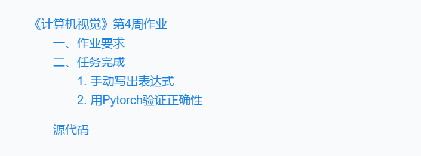
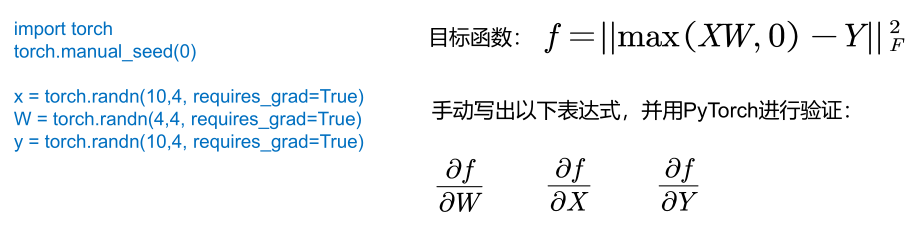
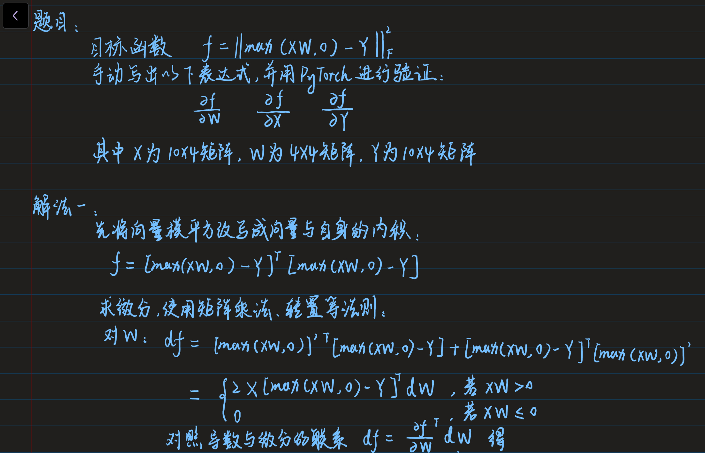
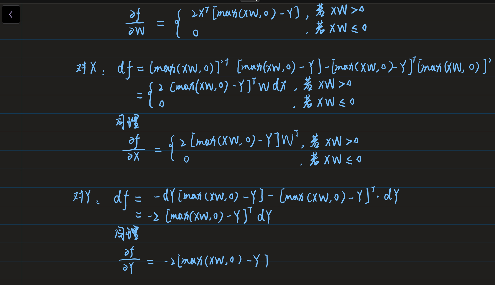
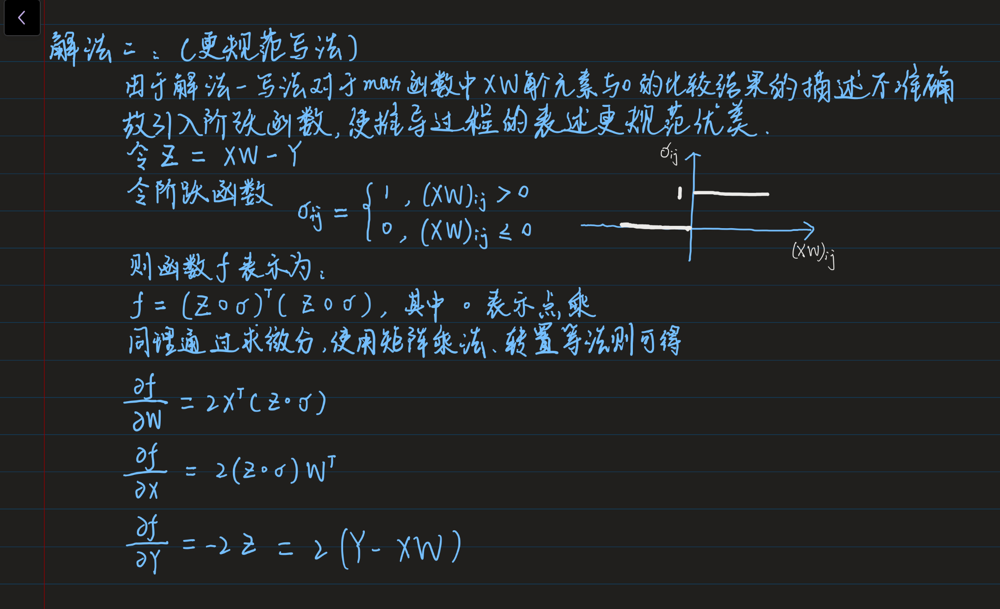
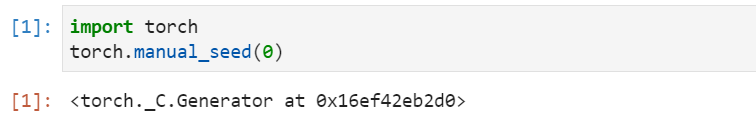
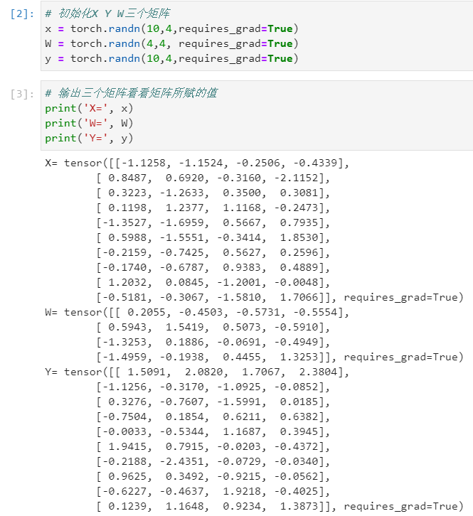
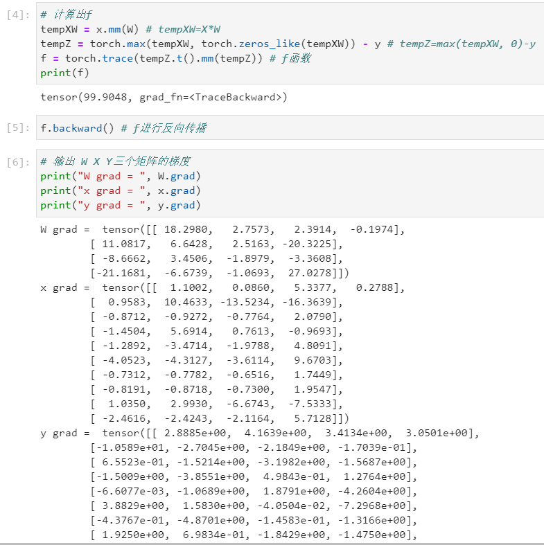
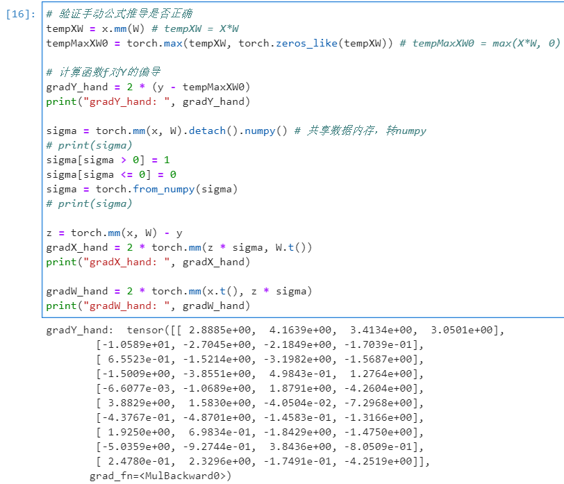
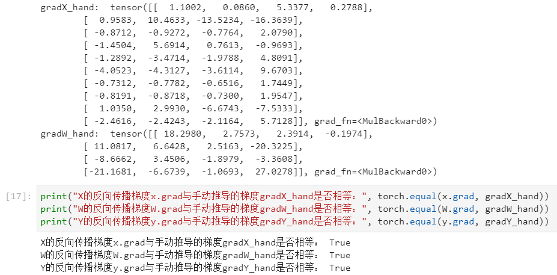

# 《计算机视觉》第4周作业
@(北京大学-计算机视觉-张健)[阮洁|2021年10月]

------------------

------------

## 一、作业要求

##  二、任务完成
### 1. 手动写出表达式

### 2. 用Pytorch验证正确性

可以看到Pytorch反向传播得出的梯度与手动推算的梯度结果一致，则结论正确。

## 源代码
代码在同目录下Homework4.jubyter文件中

链接：[https://github.com/RachelRx/PKU-HW2021/blob/main/Computer%20Vision/Homework4/Homework4.ipynb](https://github.com/RachelRx/PKU-HW2021/blob/main/Computer%20Vision/Homework4/Homework4.ipynb)
