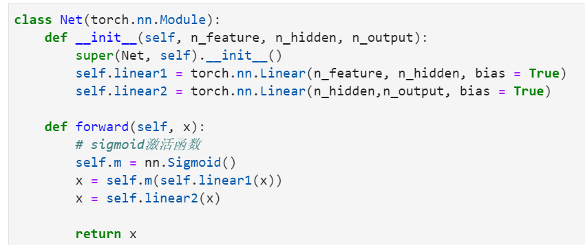
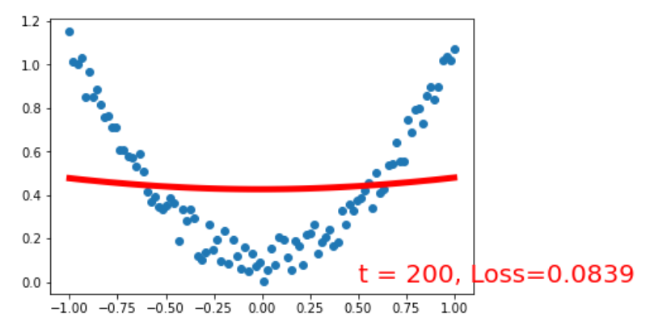
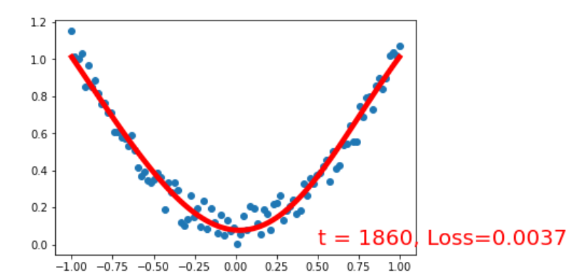
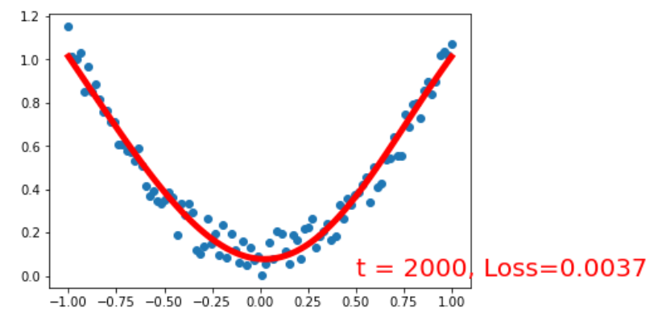
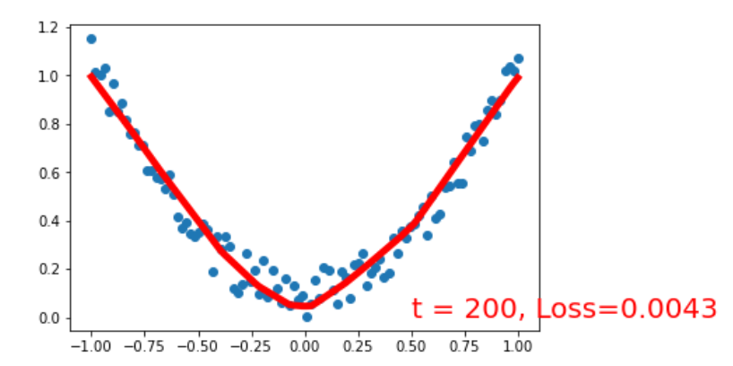
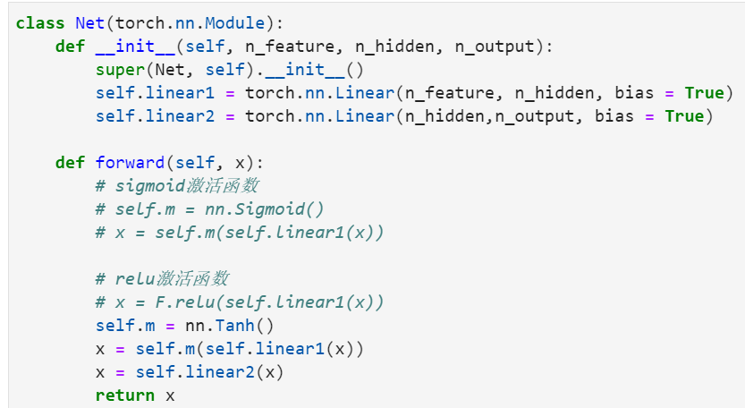
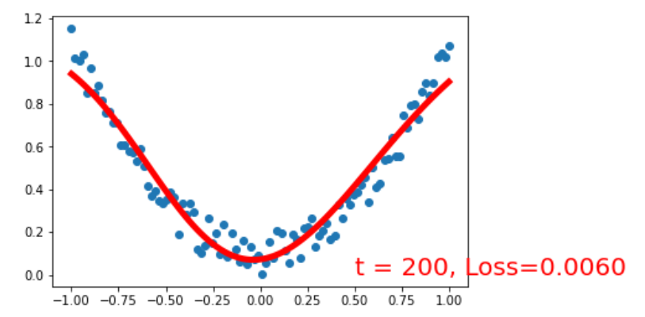
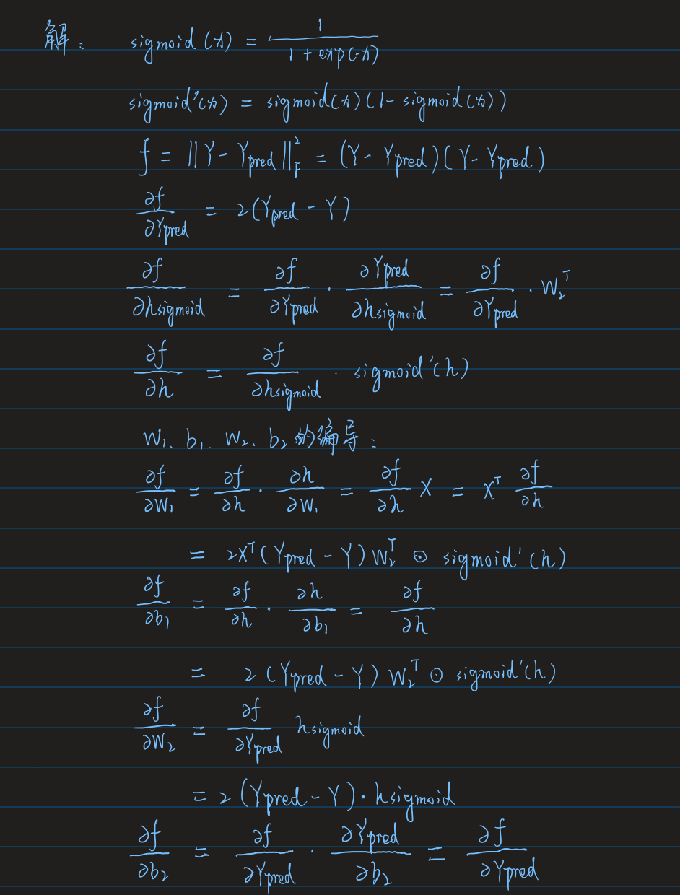

# 《计算机视觉》第5周作业
@(北京大学-计算机视觉-张健)[阮洁|2021年10月]

--------------

------------

## 一、作业要求

##  二、任务完成
### 1. 补全全连接代码
#### **初步试验**
在两层网络中补全两层全连接代码如下：

执行代码，发现在迭代200轮的情况下，loss函数不收敛，运行结果图如下：

#### **改进试验**
**调整迭代轮数**
调整迭代轮数为2000，查看是否由于迭代次数不足导致loss函数不收敛：

发现在迭代轮数为1860时，loss函数基本收敛：

**修改激活函数为ReLU**
尝试修改激活函数为PyTorch常用的ReLU函数：

试验发现loss函数在进行200轮迭代时基本收敛，这个效果比sigmoid函数更好

**修改激活函数为Tahn**

发现在迭代轮数为200的时候，函数也能基本拟合数据

函数拟合效果与学习率、激活函数类型、迭代轮数等因素有关，在进行更复杂的网络实验中，也要尝试调整参数，使得网络得到更好的效果。

### 2.给出变量W1,b1,W2,b2导数表达式

