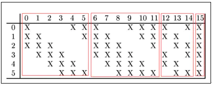
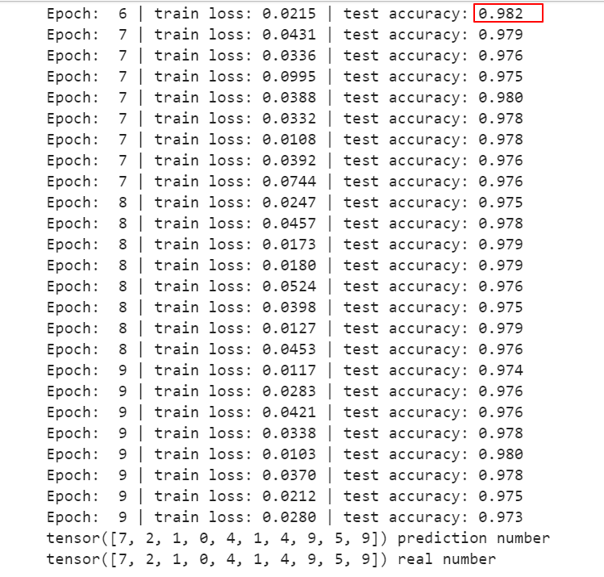

# 《计算机视觉》第6周作业
@(北京大学-计算机视觉-张健)[阮洁|2021年10月]

--------------

[TOC]

------------

## 一、作业要求

##  二、任务完成
### 1. 三层Linear实验：正确率95.5%
考虑到epoch=2时，loss函数还未完成收敛，故将epoch设置为10。不加入dropout时，模型的正确率为95.5%。在不同层引入dropout，设置不同的丢弃概率后，模型的正确率如下：
 

实验结果表明，引入dropout以后模型的正确率并没有提升，可能是因为dropout技术适合用于在类别数很大的时候，在这种情况下引入dropout可以使得模型更稳定。而MNIST数据集中仅包含10类数据，故效果不明显。

### 2. 增加卷积层实验：正确率97.7%
#### 两个卷积层
加入两个卷积层，网络结构如下：

其中`nn.Linear(in_features,out_features,bias=True)`函数中`in_features`值的计算方式为：
- 首先计算出上一个卷积层的输出特征数$n_{out}$，计算公式如下
	
由于输入图片为28*28，则可得到$n_{out}$=28+2*2-5+1=28
- 由于输入Linear前要将特征拉长为一维，故可计算出输入Linear的`in_features`值为28*28*out_channel=28*28*3=2352

**模型的正确率为97.5%**

#### 三个卷积层

**模型正确率为97.7%**

将`kernel_size`都设置为3时，模型的正确率为 96.4%
将dropout的概率设置为0.5时，模型的正确率为 95.6%，发现dropout的概率可能太大了
将dropout的概率设置为0.1时，模型的正确率为 97.1%

引入BatchNorm技术，`kernel_size`都设置为3时，模型的正确率为96.9

引入BatchNorm技术，`kernel_size`都设置为3时，模型的正确率为97.5%

### 3. LeNet神经网络：正确率98.2%

#### 3.1 LeNet神经网络原理
LeNet神经网络由深度学习三巨头之一的Yan LeCun提出，他同时也是卷积神经网络 (CNN，Convolutional Neural Networks)之父。LeNet主要用来进行手写字符的识别与分类，并在美国的银行中投入了使用。LeNet的实现确立了CNN的结构，现在神经网络中的许多内容在LeNet的网络结构中都能看到，例如卷积层，Pooling层，ReLU层。

LeNet的神经网络结构图如下：

**LeNet第一层（卷积运算）**
第一层是卷积层（C1层），卷积核的大小为5\*5，卷积核数量为6个，输入图像的大小为32*32，因此输入数据在进行第一层卷积之后，输出结果为大小为28*28，数量为6个的feature map。

**LeNet第二层（pooling运算）**
图像在LeNet网络上进行第一层卷积之后，结果为大小为28*28，数量为6个的feature map。LeNet网络的第二层为pooling层（S2层），也称为下采样。在图像处理中，下采样之后，图像的大小会变为原来的1/4，即水平方向和垂直方向上图像大小分别减半。

**LeNet第三层（卷积运算）**
LeNet第三层（C3层）也是卷积层，卷积核大小仍为5*5，不过卷积核的数量变为16个。第三层的输入为14*14的6个feature map，卷积核大小为5*5，因此卷积之后输出的feature map大小为10*10，由于卷积核有16个，因此希望输出的feature map也为16个，但由于输入有6个feature map，因此需要进行额外的处理。输入的6个feature map与输出的16个feature map的关系图如下：

如上图所示， C3的前6个feature map（对应上图第一个红框的6列）与S2层相连的3个feature map相连接（上图第一个红框），后面6个feature map与S2层相连的4个feature map相连接（上图第二个红框），后面3个feature map与S2层部分不相连的4个feature map相连接，最后一个与S2层的所有feature map相连。

**LeNet第四层（Pooling运算）**
上一层卷积运算之后，结果为大小为10*10的16个feature map，因此在第四层（S4层）进行pooling运算之后，输出结果为16个大小为5*5的feature map。与S2层进行同样的操作。

**LeNet第五层**
LeNet第五层是卷积层(C5层)，卷积核数目为120个，大小为5*5，由于第四层输出的feature map大小为5*5，因此第五层也可以看成全连接层，输出为120个大小为1*1的feature map。

**LeNet第六层**
LeNet第六层是全连接层（F6层），有84个神经元（84与输出层的设计有关），与C5层全连接。

#### 3.2 LeNet代码实现

#### 3.3 LeNet实验结果

### 参考文献
卷积神经网络中的感受野计算详细指南：https://blog.csdn.net/weixin_41481113/article/details/83269308?utm_medium=distribute.pc_relevant.none-task-blog-2~default~baidujs_baidulandingword~default-1.no_search_link&spm=1001.2101.3001.4242.2
https://blog.csdn.net/qq_42570457/article/details/81460807

### 源代码

#### 增加卷积层实验

	    class FC(nn.Module):
		    def __init__(self):
		        super(FC, self).__init__()
		        self.fc1 = nn.Conv2d(in_channels=1,out_channels=6,kernel_size=5,stride=1,padding=2)
		        self.fc2 = nn.Conv2d(in_channels=6,out_channels=8,kernel_size=5,stride=1,padding=2)
		        self.fc3 = nn.BatchNorm2d(8)
		        self.fc4 = nn.Conv2d(in_channels=8,out_channels=3,kernel_size=5,stride=1,padding=2)
		        self.fc5 = nn.Linear(2352, 10)
		        self.dropout = nn.Dropout(p=0.1)  # dropout训练
		
		    def forward(self, x):
	
		        x = self.fc1(x)
		        x = F.relu(x)
		        x = self.fc2(x)
		        x = self.fc3(x)
		#         x = self.dropout(x)
		        x = self.fc4(x)
		        x = F.relu(x)
		        x = x.view(x.size(0), -1)
		        x = self.fc5(x)
		        output = x
		        return output
		fc = FC()
		
		optimizer = torch.optim.Adam(fc.parameters(), lr=LR)
		# loss_func = nn.MSELoss()
		loss_func = nn.CrossEntropyLoss()
		
		data_size = 20000
		batch_size = 50
		
		for epoch in range(EPOCH):
		    random_indx = np.random.permutation(data_size)
		    for batch_i in range(data_size // batch_size):
		        indx = random_indx[batch_i * batch_size:(batch_i + 1) * batch_size]
		
		        b_x = train_x[indx, :]
		        b_y = train_y[indx]
		#         print(b_x.shape)
		#         print(b_y.shape)
		
		        output = fc(b_x)
		        loss = loss_func(output, b_y)
		
		        loss.backward()
		        optimizer.step()
		        optimizer.zero_grad()
		
		        if batch_i % 50 == 0:
		            test_output = fc(test_x)
		            pred_y = torch.max(test_output, 1)[1].data.squeeze()
		            # pred_y = torch.max(test_output, 1)[1].data.squeeze()
		            accuracy = torch.sum(pred_y == test_y).type(torch.FloatTensor) / test_y.size(0)
		            print('Epoch: ', epoch, '| train loss: %.4f' % loss.data.cpu().numpy(), '| test accuracy: %.3f' % accuracy)
		
		test_output = fc(test_x[:10])
		pred_y = torch.max(test_output, 1)[1].data.squeeze()  # move the computation in GPU
		
		print(pred_y, 'prediction number')
		print(test_y[:10], 'real number')

#### 使用LENET

	    class FC(nn.Module):
		    def __init__(self):
		        super(FC, self).__init__()
		        self.conv = nn.Sequential(
		            nn.Conv2d(1, 6, 5), # in_channels, out_channels, kernel_size
		            nn.BatchNorm2d(6),
		            nn.Sigmoid(),
		            nn.MaxPool2d(2, 2), # kernel_size, stride
		            nn.Conv2d(6, 16, 5),
		            nn.BatchNorm2d(16),
		            nn.Sigmoid(),
		            nn.MaxPool2d(2, 2)
		        )
		        self.fc = nn.Sequential(
		            nn.Linear(16*4*4, 120),
		            nn.BatchNorm1d(120),
		            nn.Sigmoid(),
		            nn.Linear(120, 84),
		            nn.BatchNorm1d(84),
		            nn.Sigmoid(),
		            nn.Linear(84, 10)
		        )
		
		    def forward(self, img):
		        feature = self.conv(img)
		        output = self.fc(feature.view(img.shape[0], -1))
		        return output
		
		fc = FC()
		
		optimizer = torch.optim.Adam(fc.parameters(), lr=LR)
		# loss_func = nn.MSELoss()
		loss_func = nn.CrossEntropyLoss()
		
		data_size = 20000
		batch_size = 50
		
		for epoch in range(EPOCH):
		    random_indx = np.random.permutation(data_size)
		    for batch_i in range(data_size // batch_size):
		        indx = random_indx[batch_i * batch_size:(batch_i + 1) * batch_size]
		
		        b_x = train_x[indx, :]
		        b_y = train_y[indx]
		#         print(b_x.shape)
		#         print(b_y.shape)
		
		        output = fc(b_x)
		        loss = loss_func(output, b_y)
		
		        loss.backward()
		        optimizer.step()
		        optimizer.zero_grad()
		
		        if batch_i % 50 == 0:
		            test_output = fc(test_x)
		            pred_y = torch.max(test_output, 1)[1].data.squeeze()
		            # pred_y = torch.max(test_output, 1)[1].data.squeeze()
		            accuracy = torch.sum(pred_y == test_y).type(torch.FloatTensor) / test_y.size(0)
		            print('Epoch: ', epoch, '| train loss: %.4f' % loss.data.cpu().numpy(), '| test accuracy: %.3f' % accuracy)
		
		test_output = fc(test_x[:10])
		pred_y = torch.max(test_output, 1)[1].data.squeeze()  # move the computation in GPU
		
		print(pred_y, 'prediction number')
		print(test_y[:10], 'real number')