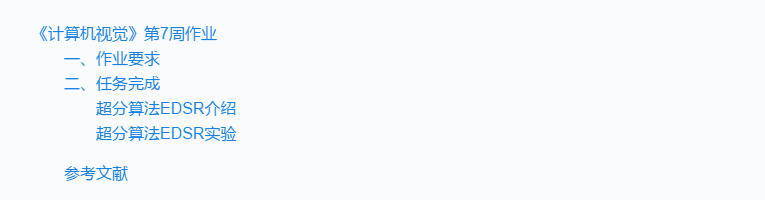

# 《计算机视觉》第7周作业
@(北京大学-计算机视觉-张健)[阮洁|2021年11月]

--------------



------------

## 一、作业要求


##  二、任务完成
### 超分算法EDSR介绍

算法EDSR来自CVPR2017[1]。是一种增强的深度超分辨率网络(EDSR)，其性能超过了目前最先进的深度超分辨率网络方法。通过去除传统残差网络中不必要的模块进行优化，使模型的性能得到了显著提高。

最初提出的ResNet是为了解决更高层次的计算机视觉问题，如图像分类和检测。因此，将ResNet体系结构直接应用于像超分辨率这样的低级视觉问题可能是次优的。为了解决这些问题，我们首先在SRResNet架构的基础上进行优化，通过分析和删除不必要的模块来简化网络架构。当模型很复杂时，训练网络就变得很重要。因此，我们使用适当的损失函数来训练网络，并在训练后仔细修改模型。实验表明，改进后的方案效果较好。

<div align=center>

<div align=center>


### 超分算法EDSR实验
**下载训练数据集**
在https://cv.snu.ac.kr/research/EDSR/DIV2K.tar下载数据集DIV2K，解压放在figs目录下


将```src/option.py```目录下的 ```dir_data``` 参数修改为数据集放置的位置


DIV2K数据集[2]是新近提出的用于图像恢复任务的高质量(2K分辨率)图像数据集。DIV2K数据集由800幅训练图像、100幅验证图像和100幅测试图像组成。

**训练19个epochs**
原代码中epochs数为300，在option.py中将epochs修改为20：


在配置好的pytorch环境中用命令`python main.py --model EDSR --scale 2 --patch_size 96 --save edsr_baseline_x2 --reset`执行项目，即开始训练，以下为前两个epoch的训练过程截图：


可以看到每个epoch的训练和测试PSNR结果，以下为最后两个epoch的训练结果


前19个epochs的训练测试结果如下：

<div align=center>

<div align=center>

300个epoch的训练测试结果对比：


## 参考文献
[1] Bee Lim, Sanghyun Son, Heewon Kim, Seungjun Nah, and Kyoung Mu Lee, **"Enhanced Deep Residual Networks for Single Image Super-Resolution,"** <i>2nd NTIRE: New Trends in Image Restoration and Enhancement workshop and challenge on image super-resolution in conjunction with **CVPR 2017**. </i> [[PDF](http://openaccess.thecvf.com/content_cvpr_2017_workshops/w12/papers/Lim_Enhanced_Deep_Residual_CVPR_2017_paper.pdf)] [[arXiv](https://arxiv.org/abs/1707.02921)] [[Slide](https://cv.snu.ac.kr/research/EDSR/Presentation_v3(release).pptx)] [[Github](https://github.com/sanghyun-son/EDSR-PyTorch)]
[2] R. Timofte, E. Agustsson, L. Van Gool, M.-H. Yang, L. Zhang, et al. Ntire 2017 challenge on single image superresolution: Methods and results. In CVPR 2017 Workshops. 1, 2, 4, 6, 7, 8